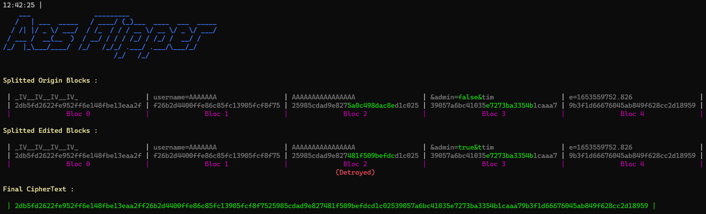
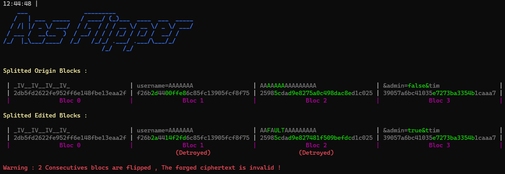

# AES-Flipper
This tool automates and facilitates an [AES CBC BitFlip attack](https://vozec.fr/articles/attaque-bit-flipping-aes_cbc/)


## Usage:

```bash
python3 aes_flipper.py -p 'plaintext' -f 'plaintext spotted' -c 'ciphertext' -e 'encoding of the ciphertext'
```

### Example :
```bash
python3 AES-Flipper.py \
	-p 'username=AAAAAAAAAAAAAAAAAAAAAAA&admin=false&time=1653559752.826288' \
	-f 'username=AAAAAAAAAAAAAAAAAAAAAAA&admin=true&ttime=1653559752.826288'
	-c 2db5fd2622fe952ff6e148fbe13eaa2ff26b2d4400ffe86c85fc13905fcf8f7525985cdad9e8275a0c498dac8ed1c02539057a6bc41035e7273ba3354b1caaa79b3f1d66676045ab849f628cc2d18959473beb8523cb6fb8610497f172748b40 \
	-e hex \
```


## Features :
- Auto-detect blocs/bytes to flip
- Auto-detect flipped bytes
- Forge Flipped ciphertext
- Alert if a flip is impossible: 2 consecutives blocs

- Specify if The first 16 bytes are the IV
- Specify the encoding of the ciphertext , reflected for the output


## Help:
```bash
$ python3 AES-Flipper.py --help

This tool automates a AES CBC BitFlip attack

options:
  -h, --help            show this help message and exit
  -p PLAINTEXT, --plaintext PLAINTEXT
                        Know Plaintext
  -f FLIPPED, --flipped FLIPPED
                        Flipped Plaintext
  -c CIPHER, --ciphertext CIPHER
                        CipherText
  -e {base64,hex,base64&hex,hex&base64}, --encoding {base64,hex,base64&hex,hex&base64}
                        CipherText Encoding
  -i, --iv              Firsts Bytes are iv
```
